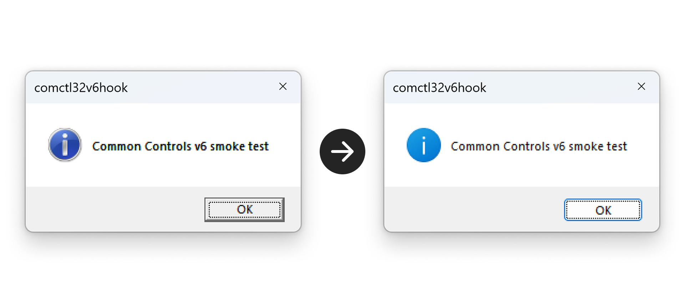

# comctl32v6hook

`comctl32v6hook` is a Windows user-mode DLL that attempts to force legacy GUI
processes into the Common Controls version 6 activation context at the moment
they create windows, dialogs, and message boxes.

The practical goal is simple: make old Win32 UI surfaces, including VBScript
`MsgBox` and classic dialog-based applications, use themed visual styles instead
of the pre-XP `comctl32.dll` version 5 look.

This project is experimental systems software. It uses process-wide DLL
injection and API detouring, so it should be treated as a debugging/research
tool rather than a general-purpose desktop customization package.

> ![WARNING]
> This project intentionally injects code into other GUI processes. Do not install
> it on production systems, shared machines, or security-sensitive environments.
> Unsigned global injection is also commonly blocked or monitored by endpoint
> security products.



## Why Common Controls v6 Matters

Windows ships multiple implementations of the common controls library. Legacy
applications that do not opt in to visual styles normally bind to Common Controls
version 5 behavior. Applications that include a manifest dependency on
`Microsoft.Windows.Common-Controls` version `6.0.0.0` receive themed controls
such as modern buttons, tab controls, list views, tree views, progress bars, and
other UX elements.

Normally, the opt-in is owned by the target process manifest. If an old
executable does not declare the dependency, Windows has no reason to use the v6
assembly for that process. This hook injects a DLL early through `AppInit_DLLs`,
creates its own activation context from a side-by-side manifest, and activates
that context around the Win32 APIs most likely to build UI.

## Architecture

At a high level, the flow is:

```text
New GUI process loads user32.dll
  -> Windows loads comctl32v6hook.dll through AppInit_DLLs
      -> DllMain resolves user32 exports
      -> DllMain creates an activation context from comctl32v6hook.manifest
      -> Microsoft Detours patches selected user32 entry points
          -> CreateWindowEx*
          -> DialogBox*
          -> CreateDialog*
          -> MessageBox*
      -> Each hooked call activates the v6 context for the duration of the call
```

The side-by-side manifest is external on purpose. At runtime the DLL calls
`GetModuleFileNameW` on itself, replaces the DLL extension with `.manifest`, and
passes that path to `CreateActCtxW`. This means the manifest must sit next to the
DLL and use the same base filename.

## Activation Context Deep Dive

Windows side-by-side assemblies are selected through activation contexts. An
activation context is a parsed manifest plus the assembly binding state derived
from it. When an activation context is active on a thread, Windows loader and UI
subsystems can resolve side-by-side dependencies from that context.

This project creates an activation context with a manifest dependency on:

```xml
<assemblyIdentity
  type="win32"
  name="Microsoft.Windows.Common-Controls"
  version="6.0.0.0"
  processorArchitecture="*"
  publicKeyToken="6595b64144ccf1df"
  language="*"
/>
```

The hook does not set this as a permanent process default. Instead, it uses a
small RAII guard:

```cpp
ActCtxGuard guard(g_hActCtx);
```

The guard calls `ActivateActCtx` before forwarding to the real API and
`DeactivateActCtx` when the hook returns. This keeps the binding override narrow
and thread-local, which is important in arbitrary third-party processes.

## Hooking Strategy

The hook uses Microsoft Detours to patch exports from `user32.dll`. Function
addresses are resolved with `GetProcAddress` from the loaded `user32.dll` module
instead of relying on the hook DLL import address table.

The currently hooked API families are:

- `CreateWindowExW` / `CreateWindowExA`
- `DialogBoxParamW` / `DialogBoxParamA`
- `DialogBoxIndirectParamW` / `DialogBoxIndirectParamA`
- `CreateDialogParamW` / `CreateDialogParamA`
- `CreateDialogIndirectParamW` / `CreateDialogIndirectParamA`
- `MessageBoxW` / `MessageBoxA`
- `MessageBoxExW` / `MessageBoxExA`
- `MessageBoxIndirectW` / `MessageBoxIndirectA`
- `MessageBoxTimeoutW` / `MessageBoxTimeoutA`, when exported by the OS

The MessageBox hooks are important. A script-level `MsgBox`, for example from
VBScript, usually ends up in the user32 MessageBox implementation. Its internal
window creation path may not pass through the public `CreateWindowEx` export in a
way that Detours can observe from this DLL. Wrapping the MessageBox API family
keeps the v6 activation context alive during the code path that builds the
message box controls.

This only covers message boxes created by code running inside a process that
has already loaded the AppInit DLL. It does not cover Windows loader/system error
dialogs, such as the "`python314.dll` was not found" dialog shown when a
load-time dependency is missing. In that failure mode the process is terminated
during load-time dynamic linking, before its normal UI code can run and often
before `user32.dll` loads the AppInit DLL. The dialog is raised by the Windows
loader/error-reporting path, not by a target-process call to `MessageBoxW` that
this DLL can detour.

## Runtime Model

`AppInit_DLLs` is the injection mechanism. Windows loads configured AppInit DLLs
into GUI processes when `user32.dll` is loaded and AppInit is enabled through the
registry. Because the hook lands in unknown processes, the implementation keeps
`DllMain` conservative:

- no heap-heavy framework initialization
- no C++ exceptions
- no UI
- no blocking operations
- no process-global policy changes beyond Detours patching

The DLL disables thread attach/detach notifications with
`DisableThreadLibraryCalls` and uses `/GS-` to reduce AppInit-time CRT/security
cookie assumptions. That choice is intentional for this injection model, but it
also means the code should stay small and careful.

## Important Limitations

This project cannot magically restyle every old UI surface.

- Loader/system error dialogs for missing load-time DLLs are out of scope. They
  are created while Windows is still trying to initialize the process, so this
  AppInit-based hook normally has no opportunity to activate a Common Controls
  v6 context for them.
- Owner-drawn controls, custom rendering, DirectUI, WPF, WinForms painting, Qt,
  Electron, browser surfaces, and many custom frameworks do not become Common
  Controls v6 widgets just because an activation context is active.
- Controls that were already created before the hook is installed will not be
  recreated.
- Some system dialogs and shell UI paths use private implementation details that
  may ignore or partially ignore this hook.
- Protected Process Light, elevated integrity boundaries, and other system
  protections can block injection.
- `AppInit_DLLs` only applies to processes that load `user32.dll`.
- On modern Windows, Secure Boot and signed AppInit policy can prevent unsigned
  AppInit DLLs from loading.

This is best understood as an activation-context experiment for classic Win32
UI, not a universal theme engine.

## Build Requirements

- Windows 10 or later
- Visual Studio with the Desktop development with C++ workload
- CMake 3.20 or newer, either on `PATH` or bundled with Visual Studio
- Git, only when the script needs to clone a local vcpkg copy
- vcpkg, optional if `VCPKG_ROOT` is already set

The build is now script-first. From a fresh checkout, the normal path is:

```cmd
build.cmd
```

`build.cmd` calls `scripts\build.ps1`, which:

- finds CMake from `PATH` or the Visual Studio install directory
- selects the newest Visual Studio CMake generator available
- uses `VCPKG_ROOT`, `VCPKG_INSTALLATION_ROOT`, a common vcpkg path, or a local
  `.deps\vcpkg` checkout
- clones and bootstraps `.deps\vcpkg` automatically when no usable vcpkg is
  found
- builds the native 64-bit architecture and `x86` on 64-bit Windows
  (`x64` + `x86` on x64 Windows, `arm64` + `x86` on Windows on Arm), or `x86`
  on 32-bit Windows
- copies ready-to-deploy outputs to `dist\<arch>`

```text
build\arm64\Release\comctl32v6hook.dll
build\arm64\Release\comctl32v6hook.manifest
build\x64\Release\comctl32v6hook.dll
build\x64\Release\comctl32v6hook.manifest
build\x86\Release\comctl32v6hook.dll
build\x86\Release\comctl32v6hook.manifest

dist\arm64\comctl32v6hook.dll
dist\arm64\comctl32v6hook.manifest
dist\x64\comctl32v6hook.dll
dist\x64\comctl32v6hook.manifest
dist\x86\comctl32v6hook.dll
dist\x86\comctl32v6hook.manifest
```

The build copies `comctl32v6hook.manifest` next to the generated DLL. Do not
deploy the DLL without the manifest.

Useful PowerShell variants:

```powershell
.\scripts\build.ps1 -Architecture arm64
.\scripts\build.ps1 -Architecture x64
.\scripts\build.ps1 -Architecture all
.\scripts\build.ps1 -Architecture both -Configuration RelWithDebInfo
.\scripts\build.ps1 -Clean
.\scripts\build.ps1 -VcpkgRoot C:\vcpkg
.\scripts\build.ps1 -NoBootstrapVcpkg
```

The CMD wrappers pause before closing so double-click runs can be read. Set
`COMCTL32V6HOOK_NO_PAUSE=1` before invoking them from automation.

## Installation

Use the one-click CMD entry from the repository root:

```cmd
install.cmd
```

`install.cmd` requests administrator permission through UAC, then runs
`scripts\install.ps1` with execution policy bypassed for that process. Build and
install are separate steps: run `build.cmd` first so the ready-to-deploy outputs
exist under `dist`, then run `install.cmd` to copy the DLL and sibling manifest
to the stable Windows deployment directories and enable AppInit.

The installer checks Secure Boot before deploying files. When Secure Boot is
enabled, Windows disables the AppInit_DLLs mechanism, so the installer stops
instead of writing registry entries that cannot take effect.

Installed files:

```text
%WINDIR%\System32\comctl32v6hook.dll
%WINDIR%\System32\comctl32v6hook.manifest

%WINDIR%\SysWOW64\comctl32v6hook.dll
%WINDIR%\SysWOW64\comctl32v6hook.manifest
```

The registry entries are split by process bitness and point at those system
directories:

```text
HKLM\SOFTWARE\Microsoft\Windows NT\CurrentVersion\Windows
  -> native 64-bit GUI processes (x64 on x64 Windows, arm64 on Windows on Arm)

HKLM\SOFTWARE\Wow6432Node\Microsoft\Windows NT\CurrentVersion\Windows
  -> 32-bit GUI processes
```

New GUI processes launched after the registry change should load the matching
DLL. Existing processes must be restarted.

PowerShell can still be used directly from an elevated 64-bit shell:

```powershell
Set-ExecutionPolicy -Scope Process Bypass
.\scripts\install.ps1
```

The installer only reads deployment-ready output from `dist\<arch>`. For a
custom prepared output root, keep the same architecture subdirectory layout
(`arm64` or `x64` for native 64-bit, plus `x86` for Wow64):

```powershell
.\scripts\install.ps1 -DistRoot C:\path\to\dist
```

`install.reg` is kept as a static fallback template for manual deployment. The
PowerShell installer is the preferred path because it resolves `%WINDIR%` at
runtime and avoids repository-specific absolute paths.

## Quick Smoke Test

After enabling AppInit, start a new VBScript host process:

```powershell
wscript.exe examples\test-msgbox.vbs
```

If the hook is loading and the activation context is valid, the message box
button style should match Common Controls v6 visual styles for the current
Windows theme.

Do not use a missing-DLL startup failure, such as launching an executable whose
load-time dependency cannot be found, as a smoke test. That produces a Windows
loader/system error dialog before the target process is usable, so it is
expected to ignore this hook.

For deeper diagnostics, use a debugger or a debug output viewer and look for
`[comctl32v6hook]` messages emitted with `OutputDebugStringW`.

## Uninstall

Use the one-click CMD entry from the repository root:

```cmd
uninstall.cmd
```

Or run PowerShell directly from an elevated 64-bit shell:

```powershell
Set-ExecutionPolicy -Scope Process Bypass
.\scripts\uninstall.ps1
```

This disables the AppInit entries immediately and schedules the deployed files
in `System32` and `SysWOW64` for deletion on the next reboot. A reboot is needed
to complete file removal when the DLL is already loaded by running GUI
processes.
